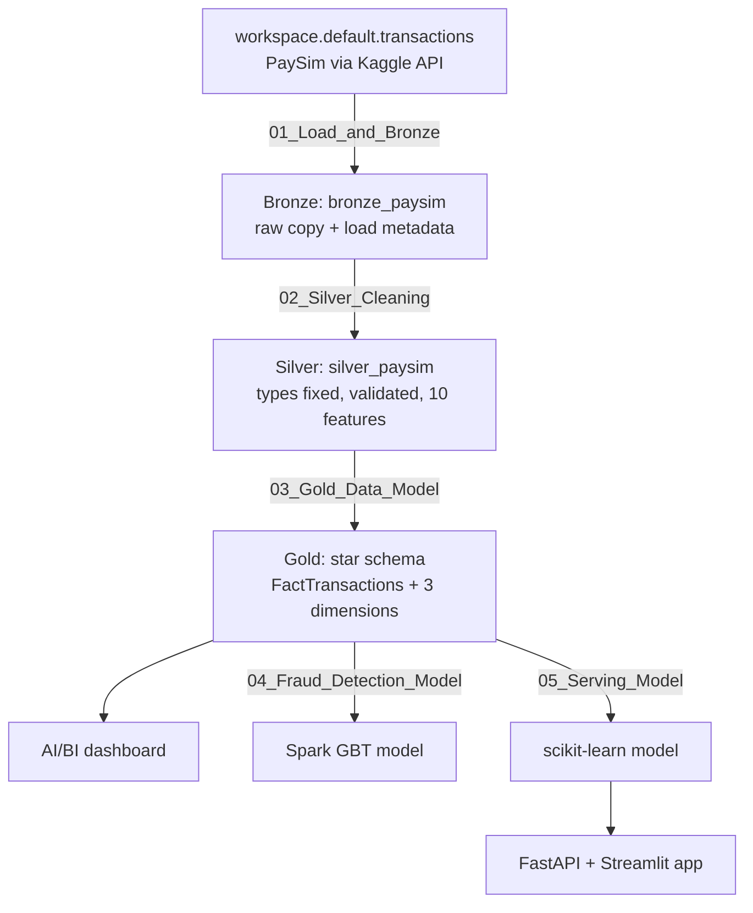
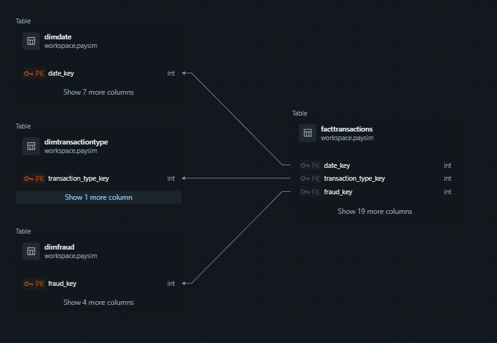
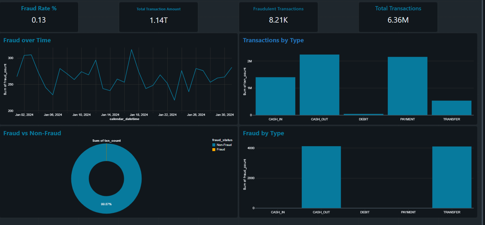
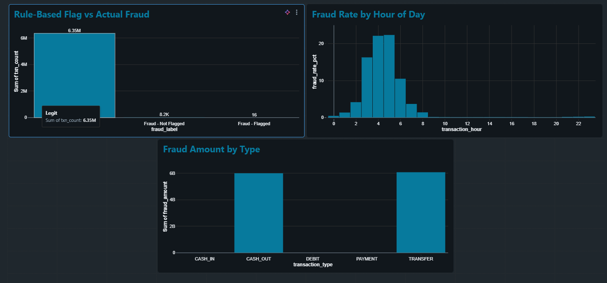
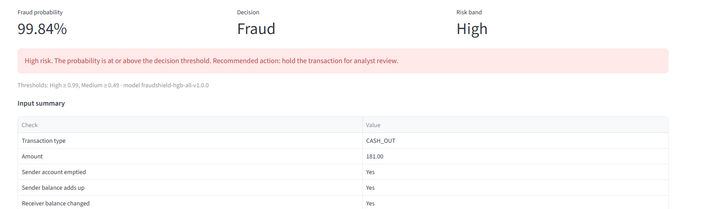
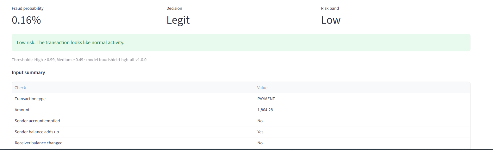

# FraudShield AI: Fraud Detection on PaySim with Databricks

An end-to-end fraud-detection project on **6,362,620 mobile-money transactions**: a Bronze → Silver → Gold pipeline in Databricks, a star-schema data model, an AI/BI dashboard, gradient-boosted tree models, and a FastAPI + Streamlit app that scores transactions in real time.

**Tech stack:** Databricks · PySpark · Spark SQL · Delta Lake · Unity Catalog · Spark MLlib · scikit-learn · FastAPI · Streamlit

---

## The problem

Fraud is rare: only **8,213 of 6,362,620 transactions (0.13%)** in PaySim are fraud. A model that always predicts "legit" would be 99.87% accurate and useless, so this project is evaluated on **precision and recall** for the fraud class.

The dataset includes a rule-based flag (`isFlaggedFraud`). It caught only **16 of 8,213** frauds, which is the case for a machine-learning model.

## Architecture



| Layer | What happens | Rows |
|---|---|---|
| Bronze | Exact copy of the source, plus `_ingested_at` and `_source` | 6,362,620 |
| Silver | Types fixed; 0 nulls, 0 duplicates, 0 invalid rows; outliers kept on purpose; 10 engineered features | 6,362,620 |
| Gold | Star schema; an automatic check confirms Fact rows = Silver rows | 6,362,620 |

## Data model



- **FactTransactions:** one row per transaction (amounts, balances, features, fraud label)
- **DimDate:** one row per simulated hour (743 rows)
- **DimTransactionType:** 5 transaction types
- **DimFraud:** 3 fraud / flag combinations

Primary and foreign keys are declared in Unity Catalog, so Databricks draws this diagram from the real tables.

## Dashboard





Key findings:
- Fraud occurs only in **TRANSFER** and **CASH_OUT** transactions.
- The fraud rate rises above 20% around hours 4–5 of the simulated day, because normal activity drops while fraud continues.
- The built-in rule flagged only 16 of 8,213 frauds.

## Models

### 1. Spark MLlib Gradient-Boosted Trees (notebook 04)

Trained on all 6.3M rows with class weights and a **time-based split** (train on the earliest 80% of simulated time, test on the latest 20%).

| Precision | Recall | F1 | ROC-AUC | PR-AUC |
|---|---|---|---|---|
| 0.9754 | 1.0000 | 0.9876 | 1.0000 | 1.0000 |

All 4,250 test-period frauds were caught, with 107 false alarms among 1,244,486 legit transactions.

**Leakage check:** retrained without the two balance-error features, the model still scored precision 0.9692, recall 0.9998, PR-AUC 0.9843. The signal comes from PaySim's balance fields as a whole, a known property of this synthetic dataset.

### 2. scikit-learn serving model (notebook 05)

`HistGradientBoostingClassifier`, evaluated with the stricter protocol used for the API:

- Frozen, reproducible **70 / 15 / 15** train / validation / test split
- Validation and test keep the **natural fraud rate**; only training is undersampled (all fraud + 10% of legit) and class-weighted
- **Decision threshold chosen on validation only** (highest threshold with recall ≥ 95%), test scored once

| Precision | Recall | F1 | ROC-AUC | PR-AUC | Frauds missed | False alarms |
|---|---|---|---|---|---|---|
| 1.0 | 0.995 | 0.9975 | 0.9987 | 0.9981 | 6 of 1,209 | 0 of 953,379 |

Risk bands: **High** ≥ 0.99 · **Medium** ≥ 0.49 · **Low** below.

## Demo app





- **FastAPI:** `POST /predict` (one transaction), `POST /predict/batch` (CSV upload), `GET /model-info`, `GET /health`, with input validation and a model version in every response
- **Streamlit:** single-transaction form, batch CSV scoring with results download, and a model-info page

## Repository structure

```
fraudshield-paysim/
├── notebooks/
│   ├── 01_Load_and_Bronze.py
│   ├── 02_Silver_Cleaning.py
│   ├── 03_Gold_Data_Model.py
│   ├── 04_Fraud_Detection_Model.py
│   └── 05_Serving_Model.py
├── sql/
│   └── dashboard_queries.sql
├── fraudshield_app/
│   ├── app/              # FastAPI: main.py, scoring.py, features.py
│   ├── streamlit_app.py
│   ├── model/            # fraudshield_model.joblib
│   ├── data/             # sample_transactions.csv
│   └── requirements.txt
└── images/
```

## How to run

**Databricks**
1. Load PaySim from [Kaggle](https://www.kaggle.com/datasets/ealaxi/paysim1) into a table (this project used `workspace.default.transactions`).
2. Import the notebooks and run 01 → 05 in order with **Run all**.
3. Build the dashboard from `sql/dashboard_queries.sql`.

**App (Python 3.12)**
```bash
cd fraudshield_app
python -m venv .venv
.venv\Scripts\activate          # Windows  (Mac/Linux: source .venv/bin/activate)
pip install -r requirements.txt
uvicorn app.main:app --reload   # terminal 1: API at http://127.0.0.1:8000/docs
streamlit run streamlit_app.py  # terminal 2: demo at http://localhost:8501
```

## Limitations

- PaySim is **synthetic**. Its balance fields separate fraud far more cleanly than real bank data would, so these scores should not be expected in production.
- The model is **decision support**: it flags transactions for analyst review and should not block customers automatically.

## Author

[Kareem Basem Goda] · [https://linkedin.com/in/kareem-goda-79b710298]
